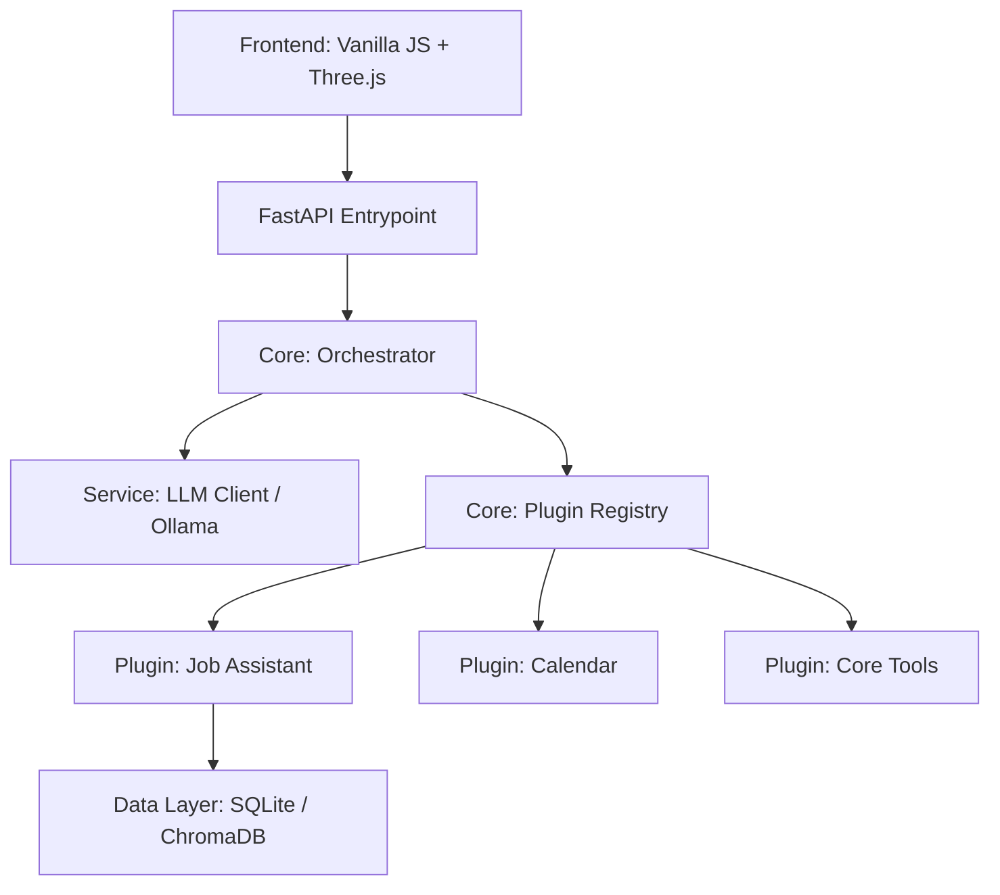

# 🏗️ Detaillierte Architektur-Übersicht

Voxentia ist als **Modulare AI-Plattform** konzipiert. Ziel ist es, eine strikte Trennung zwischen dem KI-Kern, den funktionalen Erweiterungen (Plugins) und der Benutzeroberfläche zu wahren.

## 🌌 System-Architektur

Das System besteht aus vier Hauptschichten:

---

## 🧠 Der Orchestrator (Das Gehirn)
Der Orchestrator ist die zentralisierte Logik-Einheit. Er verarbeitet jede Nachricht in drei Schritten:

1.  **Semantische Analyse**: Die Nachricht wird an den `LLMClient` gesendet. Dieser nutzt ein spezielles System-Prompt, um aus dem Text einen **Intent** (Absicht) und **Entities** (Variablen wie Datum, Ort) zu extrahieren.
2.  **Routing**: Basierend auf dem Intent sucht der Orchestrator in der `PluginRegistry` nach dem passenden Plugin.
3.  **Aggregation**: Das Plugin liefert eine `PluginResponse`. Der Orchestrator verpackt diese in eine `VoxentiaResponse`, die sowohl Text für die Sprachausgabe als auch strukturierte Daten für die UI enthält.

---

## 🔌 Das Plugin-Modell
Ein Plugin in Voxentia ist mehr als nur eine Funktion. Es ist ein abgeschlossenes Modul mit eigenem Lebenszyklus.

### Lebenszyklus eines Plugins
- **Discovery**: Die Registry findet das Plugin im Dateisystem.
- **Configuration Check**: Das System prüft in `plugin_config.json`, ob das Plugin aktiviert ist.
- **Initialization**: Die `initialize()` Methode wird aufgerufen (Datenbanken werden verbunden, API-Keys geladen).
- **Handling**: Das Plugin verarbeitet Intents.
- **Shutdown**: Ressourcen werden beim Beenden sauber freigegeben.

---

## 🔐 Sicherheitsmodell
Plugins laufen innerhalb der Voxentia-Laufzeit, haben aber eingeschränkte Zugriffe:
- **Permissions**: Plugins müssen Berechtigungen (z.B. `web_access`, `file_read`) in ihren Metadaten deklarieren.
- **Isolation**: Jedes Plugin erhält seinen eigenen `PluginContext`, der nur die notwendigen Core-Services bereitstellt.

---

## 🎨 UI-Komponenten (Plugin-UI)
Plugins können das Frontend erweitern, ohne den Kern-Code zu ändern. Über den `PluginManager` im Frontend werden spezifische Renderer registriert, die komplexe Daten (wie Job-Karten oder Kalender-Einträge) visualisieren.
