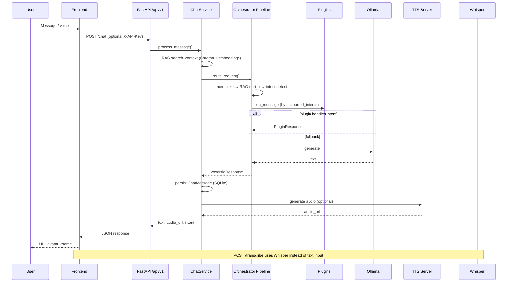

# Voxentia request flow

```mermaid
sequenceDiagram
    participant U as User
    participant FE as Frontend
    participant API as FastAPI /api/v1
    participant CS as ChatService
    participant OR as Orchestrator Pipeline
    participant PL as Plugins
    participant LLM as Ollama
    participant TTS as TTS Server
    participant WH as Whisper

    U->>FE: Message / voice
    FE->>API: POST /chat (optional X-API-Key)
    API->>CS: process_message()
    CS->>CS: RAG search_context (Chroma + embeddings)
    CS->>OR: route_request()
    OR->>OR: normalize → RAG enrich → intent detect
    OR->>PL: on_message (by supported_intents)
    alt plugin handles intent
        PL-->>OR: PluginResponse
    else fallback
        OR->>LLM: generate
        LLM-->>OR: text
    end
    OR-->>CS: VoxentiaResponse
    CS->>CS: persist ChatMessage (SQLite)
    CS->>TTS: generate audio (optional)
    TTS-->>CS: audio_url
    CS-->>API: text, audio_url, intent
    API-->>FE: JSON response
    FE-->>U: UI + avatar viseme

    Note over FE,WH: POST /transcribe uses Whisper instead of text input
```
